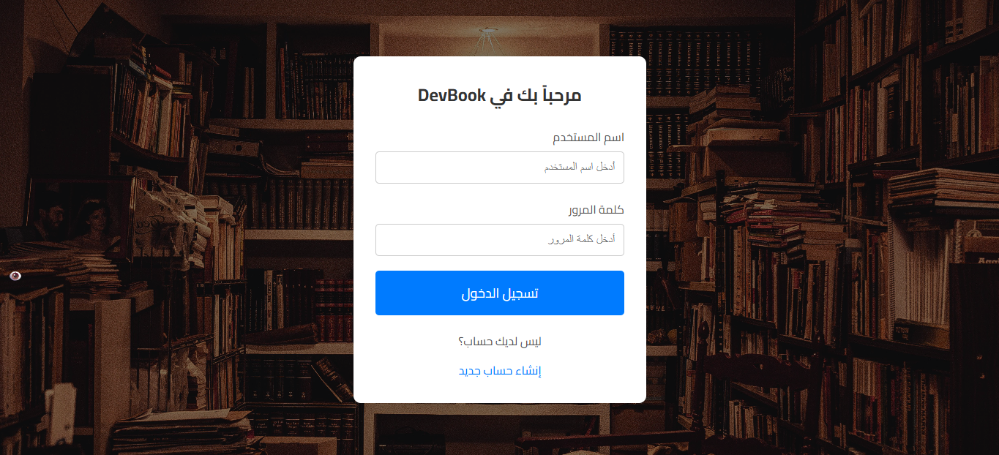
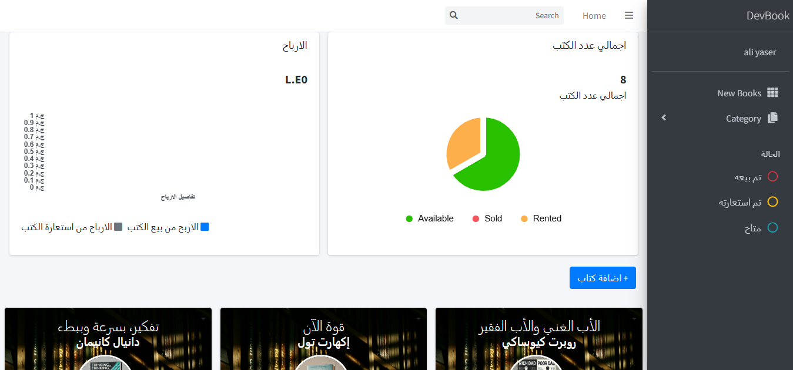
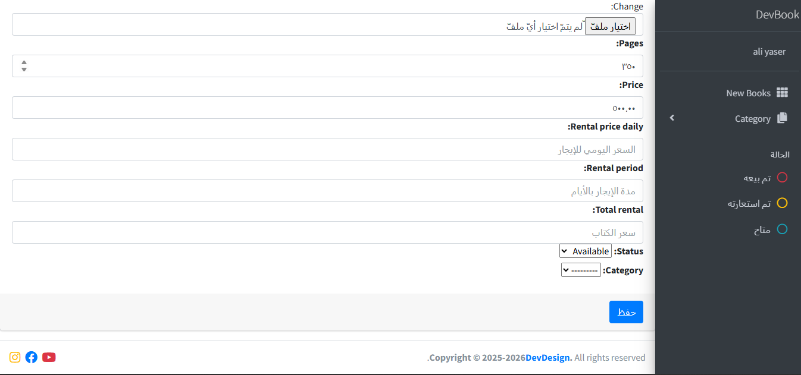

# 📖 Library Management System

A complete **Library Management System** built with **Django** and **Python**.  
This system allows for seamless **borrowing**, **purchasing**, and **returning** of books, all managed through a user-friendly interface.

---

## 🛠️ Technologies Used

- 🐍 Python  
- 🌐 Django Framework  
- 🗃️ SQLite (default database)  
- 🧩 HTML / CSS  
- ⚙️ Bootstrap (for UI styling)

---

## 📸 Screenshots

### 🔐 Login Page  


### 🏠 Home Page  


### 📊 Dashboard  


---

## ✨ Features

- Borrow and return books easily.
- Manage book purchases and rentals.
- Clean and responsive dashboard.
- Secure user authentication.

---

## ▶️ Getting Started

```bash
# 1. Install dependencies
pip install -r requirements.txt

# 2. Run the server
python manage.py runserver
